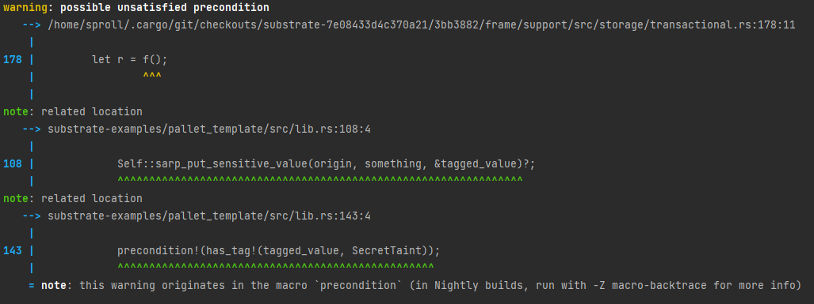
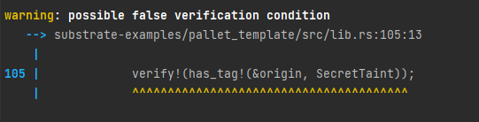
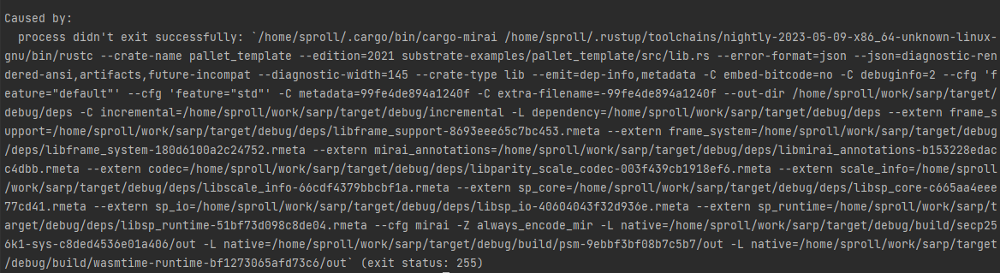
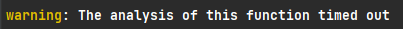

# Proof of Concept: Tag Analysis on Origin

This is a copy of [substrate's pallet template](https://github.com/substrate-developer-hub/substrate-node-template/tree/e0c480c0f322d0b0d1b310c93fa646fc0cfdd2df/pallets/template), enriched with a MIRAI [tag-analysis](https://github.com/facebookexperimental/MIRAI/blob/main/documentation/TagAnalysis.md). It is a first proof-of-concept for a [detection of unchecked origins](https://github.com/bhargavbh/MIRAI/blob/main/substrate_examples/incorrect-origin/description.md).

# Running

1. Clone this repo with `git clone https://github.com/scs/MIRAI.git`
2. Checkout this branch: `git checkout Milestone1_Research`
3. [Install MIRAI](https://github.com/facebookexperimental/MIRAI/blob/main/documentation/InstallationGuide.md)
4. Run the analysis with `cargo mirai`from within this folder. The [config.toml](.cargo/config.toml) makes sure, that the analysis only runs on the function [`mirai_check.code_to_analyze`](src/mirai.rs).

# Tag Analysis
We use [tag analysis](https://github.com/facebookexperimental/MIRAI/blob/main/documentation/TagAnalysis.md) from MIRAI. In this example, we want to verify that `ensure_signed` is called on the `origin`, before the storage is set. We implemented two wrapper functions to accomplish this:

First, we add a tag to `origin` before `ensure_signed` is called:

``` rust
fn sarp_ensure_signed(origin: &OriginFor<T>) -> Result<T::AccountId, BadOrigin> {
	add_tag!(origin, SecretTaint);
	ensure_signed(origin.clone())
}
```

Then, for writing the storage, we added a precondition, that `origin` has a tag:

``` rust
fn sarp_put_sensitive_value(origin: &OriginFor<T>, something: u32) -> DispatchResult {
    precondition!(has_tag!(origin, SecretTaint));
    <Something<T>>::put(something);
    Ok(())
}
```

To try out both cases, the following two lines can be un-/commented:

``` rust
// switch between the next two lines to either get a precondition failure in sarp_put_sensitive_value or not
let who = Self::sarp_ensure_signed(&origin)?;
// let who = ensure_signed(origin.clone())?;
```

## Output
There is a warning, when the tag is not added:



This warning is not shown, when we use the wrapper function `sarp_ensure_signed`.

## Open issues

> When reproducing the examples, make sure to run `cargo clean` after changing the [.cargo/config.toml](.cargo/config.toml).

- There seems to be an issue, with **nesting `precondition!` and `verify!` inside functions**. Although the problem could not be reproduced with the examples from the MIRAI repository. When nested inside a function we have to set `--diag=paranoid`, whereas when they are not nested a `--diag=verify` is sufficient (and results in much fewer warnings).

  To reproduce this, change the [.cargo/config.toml](.cargo/config.toml) to:

    ``` toml
  [env]
  MIRAI_FLAGS = { value = "--diag=verify --single_func=pallet_template.mirai.mirai_check.code_to_analyze"}
    ```
  And set in [src/lib.rs](src/lib.rs) lines 102-106

  ``` rust
  //let who = Self::sarp_ensure_signed(&origin)?;
  let who = ensure_signed(origin.clone())?;

  verify!(has_tag!(&origin, SecretTaint));
  self::sarp_put_sensitive_value(&origin, something)?;
  ```
  The output results in only one relevant warning:

  

- **MIRAI ends with an error**, when it is being run on the whole code:
  
 
    To reproduce this, use an empty [.cargo/config.toml](.cargo/config.toml):

    ``` toml
    [env]
    # empty config.toml
    ```

- **MIRAI runs into timeouts**, when it is being run on the whole code and debug-logging is configured. 

  Set [.cargo/config.toml](.cargo/config.toml) to:
  ``` toml
  [env]
  MIRAI_FLAGS = { value = "--diag=paranoid", force = true }
  MIRAI_LOG = { value = "debug", force = true }
  ```
  then the last line of the debug part of the output is:
  ```
  exceeded total time allowed for crate analysis
  ```
  along with several warnings of the following:

  